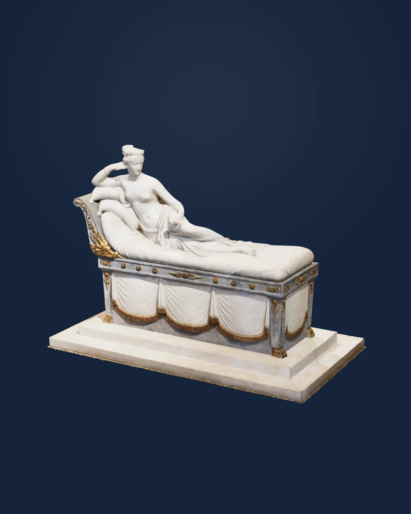
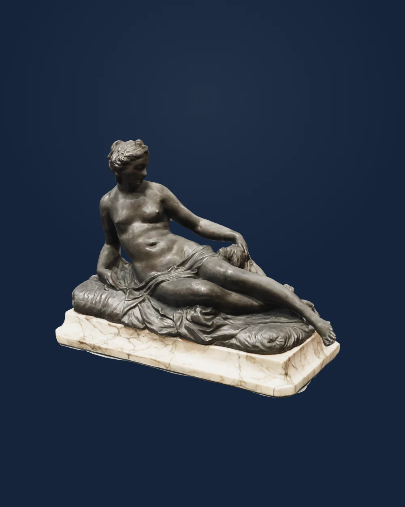
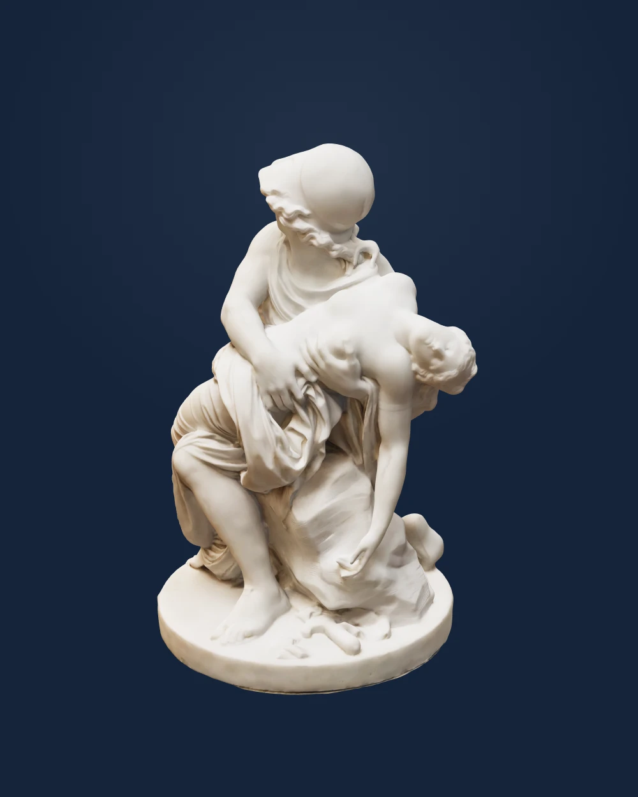
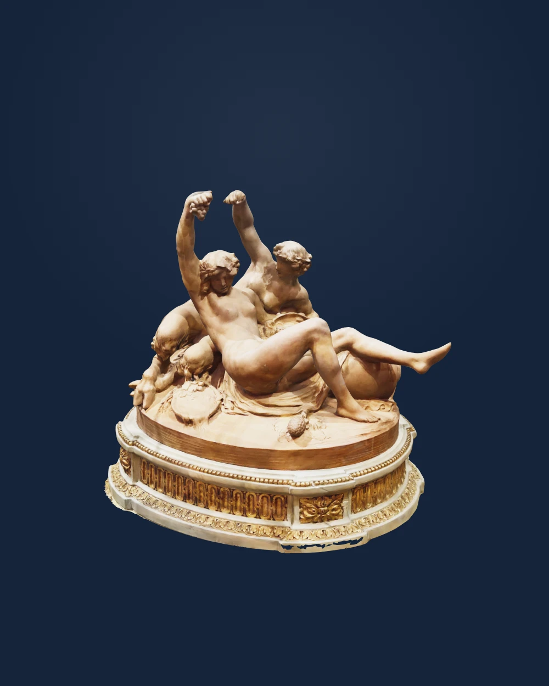
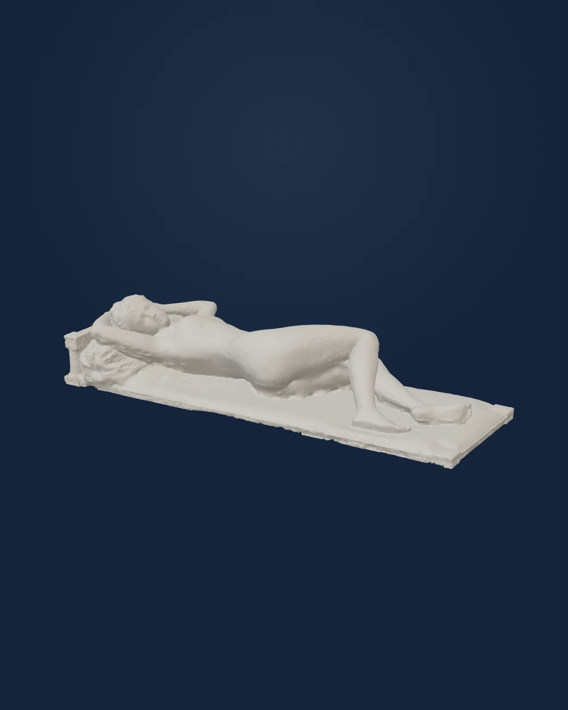
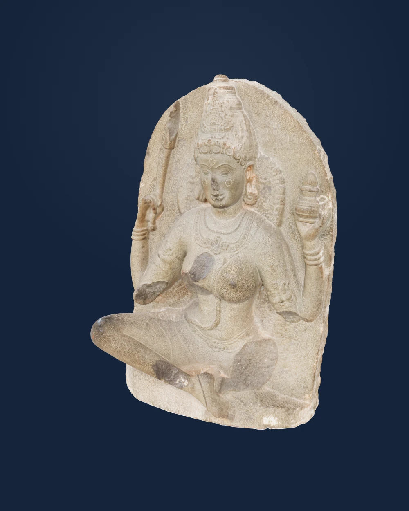
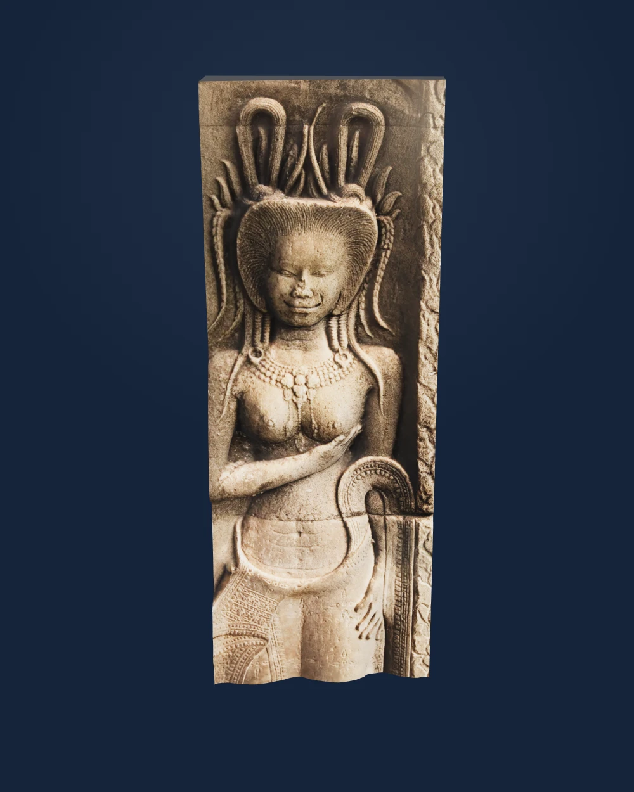
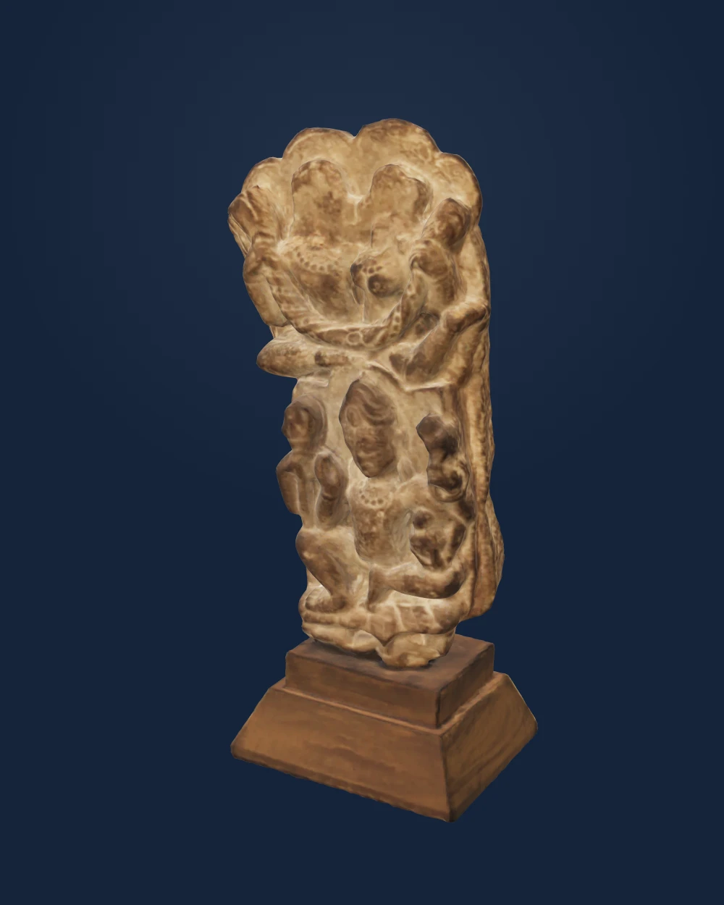

# Eight reviewed sculpture additions

**The user approved publication of these eight reviewed works with “push” on 19 September 2026.**

Five European works are the strongest matches for the adult-nude and intimate-group request. Three Asian works broaden the selection through sacred figures and a couple motif; their religious and architectural contexts remain explicit. All eight historical artworks use separately licensed public-download scans.

[View Atrium’s newest additions](https://atrium.earth/newest/).

## Paolina Borghese Bonaparte as Venus Victorious

Antonio Canova · 1804–1808 · Galleria Borghese, Rome

[View in 3D](https://atrium.earth/works/europe/paolina-borghese-venus-canova/) · [Object source](https://www.collezionegalleriaborghese.it/opere/paolina-borghese-bonaparte-come-venere-vincitrice) · [Scan source](https://poly.cam/explore/capture/493ACDC9-3ABC-4041-96BC-D27BA74E85E0/Statue%2Bof%2BPaolina%2BBorghese%2Bcomo%2BVenere%2Bvincitrice%2Bby%2BAntonio%2BCanova%2C%2BGalleria%2BBorghese%2C%2BRoma) · [CC BY 4.0](https://creativecommons.org/licenses/by/4.0/)

Canova portrays Paolina Bonaparte as Venus, reclining on an intricately carved bed and holding the apple awarded to the goddess in the Judgment of Paris.

Reviewed three angles before and after conservative floor removal. Figure, carved couch and stepped display plinth retained. Rough detail around the crown of the head and a thin uneven lower edge remain from the source capture; no sculpture geometry reconstructed.

## Reclining Nymph with Small Dog

After Georg Raphael Donner; possibly Jakob Gabriel Mollinarolo · After 1739 · Harvard Art Museums / Busch-Reisinger Museum

[View in 3D](https://atrium.earth/works/europe/reclining-nymph-small-dog-harvard/) · [Object source](https://harvardartmuseums.org/collections/object/299821) · [Scan source](https://poly.cam/explore/capture/C185B630-68AD-48C5-956D-C356791E6B5A/Reclining%2BNymph%2BWith%2Ba%2BSmall%2BDog.%2BPossibly%2Bby%2BJakob%2BGabriel%2BMollinarolo%2C%2Bafter%2B1739%2C%2Bbronze) · [CC BY 4.0](https://creativecommons.org/licenses/by/4.0/)

A reclining nymph turns toward a small dog beside her. The lead figure follows Georg Raphael Donner’s fountain figures in Vienna; the attribution to Jakob Gabriel Mollinarolo remains tentative.

Reviewed three angles. Complete surviving reclining figure, companion dog, drapery and rectangular display base are upright and readable; museum-qualified authorship and lead material retained.

## Mars and Venus

Johan Tobias Sergel · 1804 · Nationalmuseum, Stockholm

[View in 3D](https://atrium.earth/works/europe/mars-and-venus-sergel-nationalmuseum/) · [Object source](https://collection.nationalmuseum.se/en/collection/item/27403/) · [Scan source](https://poly.cam/explore/capture/2B3A4C9B-5366-4807-AD4F-68855FFBF406/Mars%2Band%2BVenus%2B%281804%2Bby%2BJohan%2BTobias%2BSergel%29) · [CC BY 4.0](https://creativecommons.org/licenses/by/4.0/)

Mars supports the wounded Venus in an episode from Homer’s Iliad. Sergel began the group in Rome in 1775 and completed it in Stockholm in 1804, shaping the two figures to be seen from every side.

Reviewed three angles. Both adult figures, drapery and round base retained and upright; the subject follows the museum’s account of Mars supporting the wounded Venus.

## Bacchante and Female Satyr

Clodion (Claude Michel) · Late 18th century · Memorial Art Gallery of the University of Rochester

[View in 3D](https://atrium.earth/works/europe/bacchante-female-satyr-clodion-mag/) · [Object source](https://www.rochester.edu/advancement/dr-james-aquavella-dedicated-to-science-and-art/) · [Scan source](https://poly.cam/explore/capture/A71F0F2F-2320-4233-B4B6-30A241D57051/Bacchante%2Band%2BFemale%2BSatyr%2C%2Blate%2B1770s%2C%2Bterracotta) · [CC BY 4.0](https://creativecommons.org/licenses/by/4.0/)

Two reclining companions raise their arms in a lively Bacchic scene. Their twisting figures and loose drapery form a compact terracotta group, mounted on an ornate display base.

Reviewed three angles before and after conservative context removal. Both figures and ornate display base retained; slight irregular margins remain at the base perimeter. The group is mounted on the base; its authorship is not separately asserted.

## Le Repos (Rest)

Alfred Boucher · 1892 · Musée d’Orsay, deposited at Musée des Beaux-Arts de Pau

[View in 3D](https://atrium.earth/works/europe/le-repos-boucher-pau/) · [Object source](https://www.musee-orsay.fr/en/artworks/le-repos-5088) · [Scan source](https://sketchfab.com/3d-models/le-repos-d083d51df07449f1a575f43675dca140) · [CC BY 4.0](https://creativecommons.org/licenses/by/4.0/)

An adult woman reclines on a cushioned bed with her arms behind her head. Boucher carved the marble in 1892; it entered the French national collection that year and has been deposited in Pau since 1978.

Reviewed three angles and final lower-exposure front view. Entire reclining figure and bed slab retained. Source colors are pale and fine facial detail is limited; the model does not reconstruct absent detail.

## Yogini with a Jar

Unknown Indian artist · early 10th century · Minneapolis Institute of Art

[View in 3D](https://atrium.earth/works/asia/yogini-with-a-jar-mia/) · [Object source](https://collections.artsmia.org/art/1380/yogini-with-a-jar-india) · [Scan source](https://sketchfab.com/3d-models/yogini-with-a-jar-early-10th-c-ce-37af26962fde41d08a3975601f641a48) · [CC BY-SA 4.0](https://creativecommons.org/licenses/by-sa/4.0/)

This seated yogini embodies female divine power. A jar and wand suggest healing, while her poised body conveys control of breath and movement. The sculpture once occupied a circular open-air temple with other yoginis.

Reviewed front, side and rear. Complete surviving sculpture extent retained; historical broken limbs are not reconstructed. Rear texture is mottled with pale horizontal bands retained from the source scan.

## Devata of Angkor

Unknown Khmer artist · Angkor period (exact date unverified) · Angkor, Cambodia

[View in 3D](https://atrium.earth/works/asia/devata-of-angkor-wilch/) · [Object source](https://sketchfab.com/3d-models/devata-of-angkor-581b8e3311264abea6a59b1ad905d28e) · [Scan source](https://sketchfab.com/3d-models/devata-of-angkor-581b8e3311264abea6a59b1ad905d28e) · [CC BY 4.0](https://creativecommons.org/licenses/by/4.0/)

An ornamented female divinity appears in shallow relief, with an elaborate Khmer hairstyle and one hand crossing her torso. The source identifies her as a devata from Angkor; the exact temple and date are undocumented.

Reviewed front, side and rear and selected a frontal hero view. Partial architectural relief ends below the hips at the source boundary; reverse and sides contain flat dark closure surfaces, not a documented record of the wall behind it. Exact temple and date remain unverified.

## Shiva with Garland, Seated under a Maithuna Couple

Unknown Indian artist · 11th–12th century · Grinnell College Museum of Art

[View in 3D](https://atrium.earth/works/asia/shiva-maithuna-couple-grinnell/) · [Object source](https://sketchfab.com/3d-models/shiva-with-garland-seated-under-maithuna-couple-01706633673a4392ba1446f9e1a3d813) · [Scan source](https://sketchfab.com/3d-models/shiva-with-garland-seated-under-maithuna-couple-01706633673a4392ba1446f9e1a3d813) · [CC BY 4.0](https://creativecommons.org/licenses/by/4.0/)

A seated Shiva carrying a garland occupies the lower part of this sandstone relief. An intimate couple appears above him. The Grinnell College Museum of Art identifies the sculpture as an Indian work of the eleventh or twelfth century.

Reviewed front, side and rear. Surviving relief and modern mounting pedestal retained. Upper pair is side by side in a non-graphic intimate group; facial and surface detail is soft in the source scan.

## Validation

Whole-object model renders checked at three angles, with original/cleaned comparisons for Paolina and Clodion. Source and derivative hashes are recorded in review-manifest.json. No strict physical scale calibration is claimed.

Seven scans and their derivative renders are CC BY 4.0. Yogini and its derivative model/renders are CC BY-SA 4.0. Source credit, license links and modification notices remain in the visible object credits.

This change adds eight works to the 1,224-record baseline, for 1,232 catalog records and 1,220 public works. It preserves all earlier records and their runtime metadata.

Wing assignment, newest-additions grouping, catalog-asset validation, whitespace checks and production build passed. The build produced 3,217 static pages. Local HTTP checks verified all eight work pages, model files and thumbnails against their recorded hashes.

Interactive browser click-through was unavailable because the Mac was locked. Whole-model headless renders completed successfully. See [validation details](validation.json).

An independent audit confirmed that all 1,224 existing records and prior runtime metadata are unchanged, and that all eight additions match their model and thumbnail manifests.
